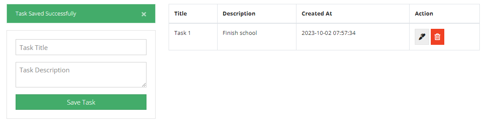
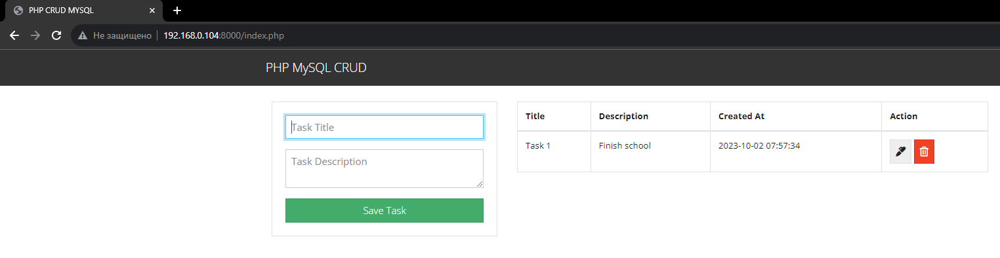

# Screenshot


To-do list web-application and mysql

- Web-application: php:8 + apache
- Database: MySQL:8
# Docker-compose file
```yml
version: '3.7'
services:
  mysql: 
    container_name: php_mysql_crud_db
    image: mysql:8
    restart: always
    command: --init-file /tmp/script.sql
    ports:
      - 3306:3306
    environment:
      MYSQL_ROOT_PASSWORD: password123
      MYSQL_DATABASE: php_mysql_crud
      MYSQL_USER: test_user
      MYSQL_PASSWORD: test_password
    volumes:
      - ./database/:/tmp
      - ./db/:/var/lib/mysql

  web:
    container_name: php_mysql_crud_web
    build:
      context: .
      dockerfile: Dockerfile-apache
    volumes:
      - "./src:/var/www/html" # sync the current dir on local machine to the dir of container
    restart: always
    ports:
      - 80:80
    depends_on:
      - mysql
    environment:
      - WAIT_HOSTS=mysql:3306

```

## Running application via docker-compose
1. Running mysql db service
    - **containter name : php_mysql_crud_db** - container name that will be running
    - **image : mysql:8** - using image of mysql 8 version from [dockerhub](https://github.com/docker-library/mysql/tree/eb1850601849ef7ef77a23f017a20debc95d597c/8.0) 
    - **restart always** - restaring if container stop
    - **command: --init-file /tmp/script.sql** - from /database/ folder (in container it will be /tmp/ folder) run init script for creating database and table
    - **ports: 3306:3306** - open port in container 
    - **environment** - environment variables from [mysql](https://hub.docker.com/_/mysql#:~:text=tag%20%2D%2Dverbose%20%2D%2Dhelp-,Environment%20Variables,-When%20you%20start) 
        -    **MYSQL_ROOT_PASSWORD: password123** - if not assigned, container would be stop
        -    **MYSQL_DATABASE: php_mysql_crud** - name of db. See ``/database/script.sql`` and ``/src/db.php``, that required for connection for user
        -    **MYSQL_USER: test_user** - name of user (can be root but for password MYSQL_ROOT_PASSWORD)
        -    **MYSQL_PASSWORD: test_password** - password of MYSQL_USER
    - volumes - Dynamicly update all content
        - **./database/:/tmp**  -   all content from ``./database/`` go ``/tmp/``, needs for running /database/script.sql
        - **./db/:/var/lib/mysql** -    if running first time, db folder will be created. Folder for saving db in host machine.
2. Running php:8 + apache
    - **container_name: php_mysql_crud_web** - container name
    - **build**
        -   **context: .**  - path for Dockerfile
        -   **dockerfile: Dockerfile-apache** - name of Dockerfile
    - **volumes** - Dynamicly update all content
        -  **./src:/var/www/html** - all content from ``./src`` go ``/var/www/html``. Folder for apache service
    - **restart: always** - restart container if stop
    - **ports: ["8000:80"]**  - open port for apache
    - **depens_on** - wait *mysql* *service* to be running
    - **environment: [WAIT_HOSTS=mysql:3306]** - another method for making *web* to wait *mysql*

## Dockerfile

```dockerfile
FROM php:8.0-apache
COPY ./src /var/www/html
RUN docker-php-ext-install mysqli && docker-php-ext-enable mysqli
RUN apt-get update && apt-get upgrade -y
```

## db.php
Changed original file from forked repo

OLD VERSION
```php
<?php
session_start();

$conn = mysqli_connect(
  'localhost',
  'root',
  'password123',
  'php_mysql_crud'
) or die(mysqli_erro($mysqli));

?>
```

NEW VERSION
```php
<?php
session_start();

    define("DB_HOST", 'mysql');
    define("DB_USERNAME", 'test_user');
    define("DB_PASSWORD", 'test_password');
    define("DB_DATABASE", 'php_mysql_crud');
 
    $conn = mysqli_connect(DB_HOST, DB_USERNAME, DB_PASSWORD,DB_DATABASE) or die();

?>
```
Create connection php and db

```define("DB_HOST", 'mysql');``` - *mysql* from `docker-compose.yml` [INFO FROM HERE](https://stackoverflow.com/questions/62489315/two-docker-containers-cannot-communicate)

```yml
docker-compose.yml
...
services:
  mysql: 
    container_name: php_mysql_crud_db
...
```

## index.php

I changed original file from forked repo 

OLD VERSION
```php

<?php
$query = "SELECT * FROM task";
$result_tasks = mysqli_query($conn, $query);    

while($row = mysqli_fetch_assoc($result_tasks)) { ?>
<tr>
<td><?php echo $row['title']; ?></td>
<td><?php echo $row['description']; ?></td>
<td><?php echo $row['created_at']; ?></td>
<td>
    <a href="edit.php?id=<?php echo $row['id']?>" class="btn btn-secondary">
    <i class="fas fa-marker"></i>
    </a>
    <a href="delete_task.php?id=<?php echo $row['id']?>" class="btn btn-danger">
    <i class="far fa-trash-alt"></i>
    </a>
</td>
</tr>
<?php } ?>
```

NEW VERSION
```PHP
<?php
    $query = "SELECT * FROM task";
    $result_tasks = mysqli_query($conn, $query);

    if ($result_tasks) { //<----------------- THIS CHANGED
        while($row = mysqli_fetch_assoc($result_tasks)) { ?>
            <tr>
    <td><?php echo $row['title']; ?></td>
    <td><?php echo $row['description']; ?></td>
    <td><?php echo $row['created_at']; ?></td>
    <td>
        <a href="edit.php?id=<?php echo $row['id']?>" class="btn btn-secondary">
        <i class="fas fa-marker"></i>
        </a>
        <a href="delete_task.php?id=<?php echo $row['id']?>" class="btn btn-danger">
        <i class="far fa-trash-alt"></i>
        </a>
    </td>
    </tr>
        <?php }
    } else {
        echo "Error: " . mysqli_error($conn);
    }
    ?>
```

## Running applicaion

OS 
```bash
yehor@laptop:~/php-mysql-crud$ lsb_release -a
No LSB modules are available.
Distributor ID: Ubuntu
Description:    Ubuntu 22.04.3 LTS
Release:        22.04
Codename:       jammy
```

Docker Engine
```bash
yehor@laptop:~/php-mysql-crud$ docker version
Client: Docker Engine - Community
 Version:           24.0.6
```

Docker-compose 
```bash
yehor@laptop:~/php-mysql-crud$ docker-compose version
docker-compose version 1.29.2, build unknown
docker-py version: 5.0.3
CPython version: 3.10.12
OpenSSL version: OpenSSL 3.0.2 15 Mar 2022
```
Run
- Open folder with project `./php-mysql-crud`
- Run ``` docker-compose up -d ```
- Open localhost:8000 (or IP address of server with :8000) in web browser(Chorme,Morzilla Firefox,Edge)

